## 概述

[AlexNet](https://baike.baidu.com/item/AlexNet/22689612?fr=aladdin)是2012年[ImageNet](https://baike.baidu.com/item/ImageNet/17752829)竞赛冠军获得者Alex Krizhevsky、[Hinton](https://baike.baidu.com/item/%E6%9D%B0%E5%BC%97%E9%87%8C%C2%B7%E8%BE%9B%E9%A1%BF/23419046?fr=aladdin)（获2019图灵奖）和Ilya Sutskever（Alpha GO、TensorFlow的开发者）设计的。原论文名为***ImageNet Classification with Deep Convolutional Neural Networks***（使用深度神经网络对ImageNet进行图像分类），是计算机视觉领域最为经典的论文之一，引用量至今已达1.4万次，主要提出者Alex Krizhevsky是人工智能教父Hinton的学生，这三位作者被称为人工智能三巨头。

因为AlexNet的提出，使得那一年之后，更多的更深的神经网络被提出，比如优秀的[VGG](https://baike.baidu.com/item/VGG%20%E6%A8%A1%E5%9E%8B/22689655?fr=aladdin),[GoogLeNet](https://baike.baidu.com/item/GoogLeNet/22689587)，他们都是基于AlexNet的深度卷积神经网络来提取图像特征的。尽管AlexNet是2012年提出的模型，在如今已经有了更多的更优秀的模型，但是他们都是从AlexNet中得到启发。其首次将深度学习应用在大规模的图像分类上，在当时在产业界和学术界引发了很大的轰动。之后不管是图像分类，目标检测、语义分割都是在AlexNet的基础之上，AlexNet奠定了计算机视觉深度学习的基本模型方法和技巧。所以我认为AlexNet是学习计算机视觉必须了解的一个模型。

今天我将通过精读这篇论文原文的方式去了解AlexNet的一些基本思想和原理。

AlexNet论文链接：http://www.cs.toronto.edu/~fritz/absps/imagenet.pdf

## 论文精读 

### 摘要

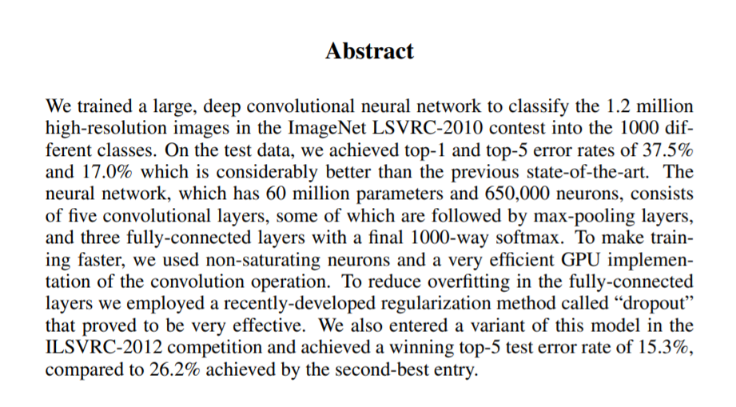

在此处，作者讲述了他们训练了一个又大又深的卷积神经网络去对120万个高分辨率的图像进行了1000个类别的分类。在测试数据集中，他们达到了TOP1错误率37.5%、TOP5错误率17%，是当年最先进的成果，在这个神经网络中有6000万个参数和65万个神经元，有五个卷积层，他们中有些后面跟着池化层，在之后是三个全连接层（一千个分类的线性分类，）最后是softmax归一化。为了更快的训练这个网络，他们用了一个不饱和的激活函数，以及两个GPU并行的方法。为了减少过拟合，他们用了一个他们最近提出的且在当时十分有效的正则化方法：dropout。在2012年的ILSVRC的比赛中取得了TOP5错误率15.3%的好成绩（第二名TOP5错误率为26.2%）

### 介绍

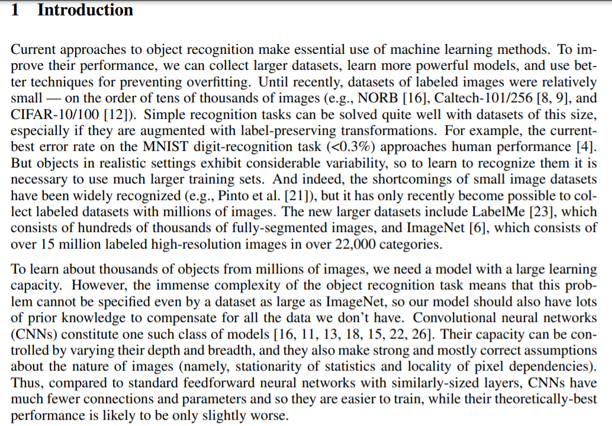

当前的图像识别方法都会使用机器学习方法。为了提高它们的性能，我们可以收集更大的数据集，学习更强大的模型，并使用更好的技术来防止过度拟合。直到最近（2012年），标记图像的数据集相对
小——大约有数万张图像（例如 纽约大学的NORB [16]数据集、加州理工的Caltech-101/256 [8, 9] 和
加拿大高等研究院CIFAR-10/100 [12])。使用这种大小的数据集可以很好地解决简单的识别任务，
特别是当它们采用图像增强的方法去保留一些标签时。例如，MNIST 手写识别在2012年的最佳错误率低于0.3% 已经接近人类表现 。但是现实世界中的数据集是完全不同的，（如CIFAR是32x32x3的分辨率，而现在的图片通常分辨率都是1024以上）。因此要学会识别它们是需要使用更大的训练集。其实，小图像数据集的缺点已被学者广泛了解，但直到最近才有了具有了收集数百万张图像的标记数据集。比如说 LabelMe ，以及由数十万张完全分割的图像（包括超过 22,000 个类别的超过 1500 万张标记的高分辨率图像）组成的ImageNet 。
要从数百万张图像中了解数千个对象，我们需要一个具有大量学习能力的模型。然而，图像识别任务的巨大且复杂，所以我们的模型也应该有很多的先验知识来弥补我们没有的所有数据。卷积神经网络
(CNNs) 就构成了这样一个模型 。他们的学习能力可以通过改变他们的深度（网络层数）和宽度（每一层里卷积核的个数）来控制，他们也做出了强有力的、基本正确的图像推断。因此，与具有类似大小层的标准前馈神经网络相比，CNN 具有更少的连接和参数，因此它们更容易训练，而它们理论上最好的性能可能只会稍微差一点。
尽管 CNN 非常的好，尽管它们的局部连接是很高效的，但将它们大规模应用的成本也很高。幸运的是，当前的 GPU 有了高度优化的2维卷积实现，它功能的强大足以应用大型 CNN ，并且最近的数据集（如 ImageNet）也包含足够的标记示例来训练此类模型，而不会出现严重的过拟合。
本文的具体贡献如下：我们训练了ILSVRC-2010 和 ILSVRC-2012 中使用的最大的卷积神经网络， 并取得了迄今为止最好的成绩。我们写了一个高度优化 GPU 实现训练卷积神经网络，并开源了代码。我们的模型包含许多新的和不寻常的特征以提高其性能并减少其训练时间，会在第 3 节详述。因为我们的模型深度很深，即使有 120 万个带标签的训练示例，我们的模型仍然容易过拟合，因此我们使用了几种有效的技术来防止过拟合，这在第 4 节中描述。我们的最终网络包含五个卷积层和三个全连接层，而且它们的深度很重要：我们发现删除任何
卷积层（每个包含不超过模型参数的 1%），都会导致性能变得比较差。
最后，网络的大小主要受当前 GPU 上可用内存量的限制以及我们愿意容忍的训练时间。我们的网络需要五到六天
在两个 GTX 580 3GB GPU 上训练。我们所有的实验都表明：我们的结果可以简单地通过以后研发的更快的 GPU 和更大的数据集来进行更好的优化。

### 数据集

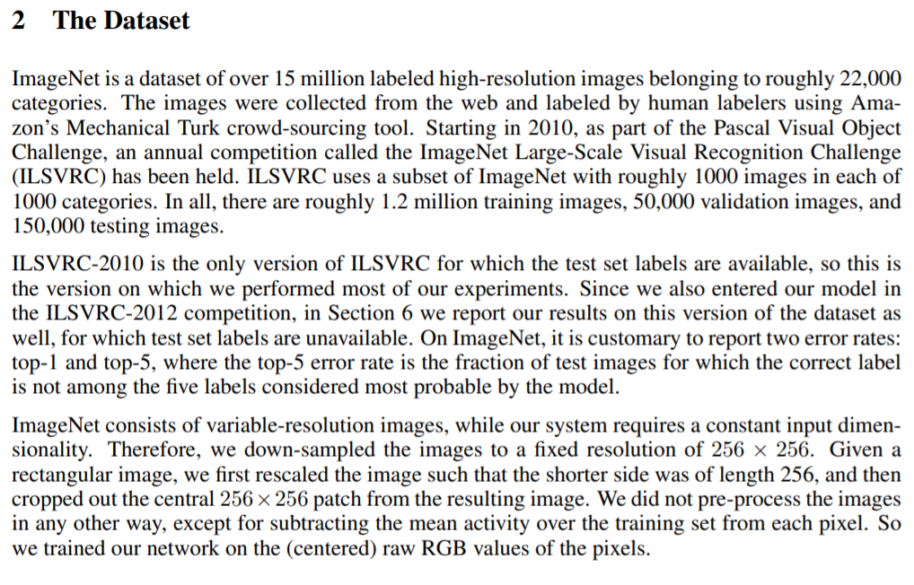

ImageNet 是一个包含超过 1500 万张标记过的高分辨率图像的数据集，这些图像属于大约 分为22,000
个类别。这些图像是从网络上收集的，并由人工标注，使用的是亚马逊的 Mechanical Turk 众包工具进行标记。从 2010 年开始，一项名为 ImageNet 大规模视觉识别挑战赛的年度竞赛(ILSVRC)被作为 Pascal Visual Object 的一部分举行。 ILSVRC 使用的是 ImageNet 的一个子集，每个子集大约有 1000 个图像，分为1000个类别。总共有大约 120 万张训练图像、50,000 张验证图像和150,000 张测试图像。
ILSVRC-2010 是唯一测试集标签公开的 ILSVRC 比赛，所以我们大部分实验都在此比赛进行。我们也参加了 ILSVRC-2012 竞赛，在第 6 节中，我们汇报这次比赛的结果。在 ImageNet 上，习惯上有两种错误率评判标准：
top-1 和 top-5，其中 top-1是预测的第一个标签正确的情况，top-5 是前五个预测标签里包含正确结果的情况。
ImageNet 由不同的分辨率的图像组成，而我们的模型需要固定分辨率的方形图像。因此，我们将图像下采样到 256 × 256 的固定分辨率。
例如一张矩形图像，我们首先重新缩放图像，使短边的长度为 256，然后从结果图像中裁剪出中央 256×256 块，计算出每个像素的均值并减去对应的均值（类似于中心化）。除了从每个像素中裁剪以外，我们没有以任何其他方式预处理过图像。所以，我们是用以0为均值的RGB图片来训练的。

### 该网络的架构

图 2 是我们网络的架构的总结。它包含八个学习层——五个卷积和三个全连接。 下面，我们讲述一些我们网络架构新颖或不寻常的的特点。 第 3.1-3.4 节是根据我们对它们的重要性排布的，最重要的放在最前面。

####  ReLU函数

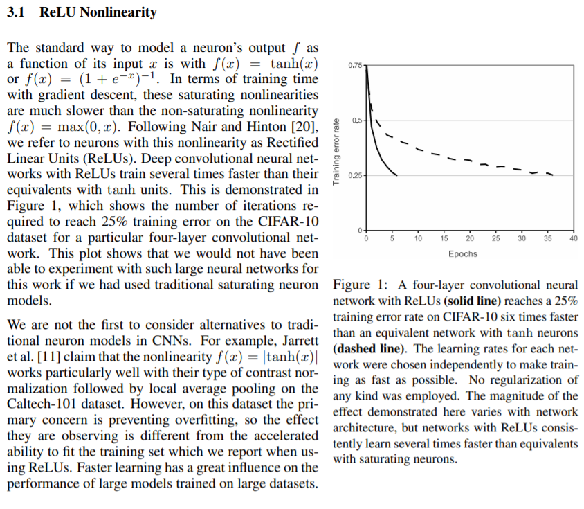

我们之前通常把或作为激活函数。就梯度下降的训练时间而言，这些饱和非线性的激活函数比非饱和非线性激活函数慢得多，而我们用的带有 ReLU 的深度卷积神经网络的训练速度比双曲线激活函数它们的快几倍。比如在
图 1，具有 ReLU 的四层卷积神经网络在 CIFAR-10 上达到 25% 的训练错误率比具有 tanh 神经元的等效网络快六倍。这表明如果我们使用传统的激活函数将无法在如此大的神经网络上使用。
我们并不是第一个考虑替代 CNN 中替换掉激活函数的人。例如，贾勒特用双曲线激活函数的绝对值 在Caltech-101 数据集上配合局部平均池化后的效果比较好。然而，在这个数据集上，主要目的是防止过拟合，他们观察到的效果与我们在使用 ReLU 时报告的适应训练集的加速能力不同。快速训练对在大型数据集上训练的大型模型的性能有很大影响。

图 1：具有 ReLU 的四层卷积神经网络（实线）在 CIFAR-10 上达到 25% 的训练错误率，比具有 tanh 神经元的等效网络（虚线）快六倍。 每个网络的学习率都是独立选择的，以使训练尽可能快。 没有采用任何形式的正则化。 这里展示的效果的大小因网络架构而异，但使用 ReLU 的激活函数始终比使用饱和的激活函数学习速度快几倍。

#### 多GPU训练

在当时，单个 GTX 580 GPU 只有 3GB 的内存，这限制了可以在其上训练的网络的最大大小。根据反向传播原理，显存中不仅存储模型参数，还需储存正向传播时每一层整个batch的中间结果。因此，我们将网络分布在两个 GPU 上。当前的 GPU 是可以跨 GPU 并行化，因为它们能够直接读取和写入彼此的内存，而无需经过主机内存。我们采用的并行化方案本质上是将一半的内核（或神经元）放在每个 GPU 上，GPU 仅在某些层中进行通信。例如，第 3 层的内核从第 2 层的所有内核映射中获取输入，第 4 层中的内核仅从位于同一 GPU 上的第 3 层内核映射中获取输入。我们选择交叉验证，这能使我们精确地调整通信量，直到它是达到十分合适的效果。由此产生架构的除了我们的列不是独立的以外，有点类似于“柱状”CNN 的架构。与在一个 GPU 上训练的每个卷积层中内核数量减半的网络相比，该方案分别将我们的 top-1 和 top-5 错误率降低了 1.7% 和 1.2%。且双 GPU 神经网络的训练时间比单 GPU 神经网络所需的时间短。

#### 局部响应归一化

`ReLU`具有让人满意的特性，它不需要通过输入归一化来防止饱和。如果至少一些训练样本对`ReLU`产生了正输入，那么那个神经元上将发生学习。然而，我们仍然发现接下来的局部响应归一化有助于泛化。通过下式给定式：

求和运算在`n`个“毗邻的”核映射的同一位置上执行，N是本层的卷积核数目。核映射的顺序当然是任意的，在训练开始前确定。响应归一化的顺序实现了一种侧抑制形式，灵感来自于真实神经元中发现的类型，为使用不同核进行神经元输出计算的较大活动创造了竞争。常量`k，n，α，β`是超参数，它们的值通过验证集确定；我们设`k=2，n=5，α=0.0001，β=0.75`。我们在特定的层使用的`ReLU`非线性之后应用了这种归一化（请看3.5小节）。

这个方案与Jarrett等人[11]的局部对比度归一化方案有一定的相似性，但我们更恰当的称其为“亮度归一化”，因此我们没有减去均值。响应归一化分别减少了`top-1 1.4%`，`top-5 1.2%`的错误率。我们也在CIFAR-10数据集上验证了这个方案的有效性：一个乜嘢归一化的四层CNN取得了13%的错误率，而使用归一化取得了11%的错误率。

#### 重叠池化

CNN中的池化层归纳了同一核映射上相邻组神经元的输出。习惯上，相邻池化单元归纳的区域是不重叠的（例如[17, 11, 4]）。更确切的说，池化层可看作由池化单元网格组成，池每个像素网格总结了池单元位置处`size z× z centered`的邻域。如果我们设置`=z`，我们将获得传统的本地池，作为CNNs中的常用池。如果我们设置`< z`，我们获得重叠池。这是我们在整个网络中使用的，`s = 2，z= 3`。与产生等效尺寸输出的非重叠方案`s= 2，z= 2`相比，该方案将前1和前5的错误率分别降低`0.4%`和`0.3%`。我们通常在训练中观察到，过度汇集的模型会发现稍微更难过度汇集相比，输出的维度是相等的。我们在训练过程中通常观察采用重叠池化的模型，发现它更难过拟合。

####  整体架构

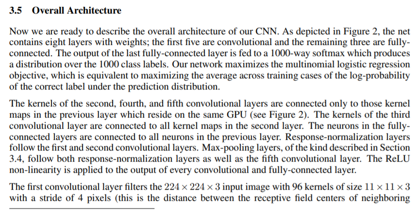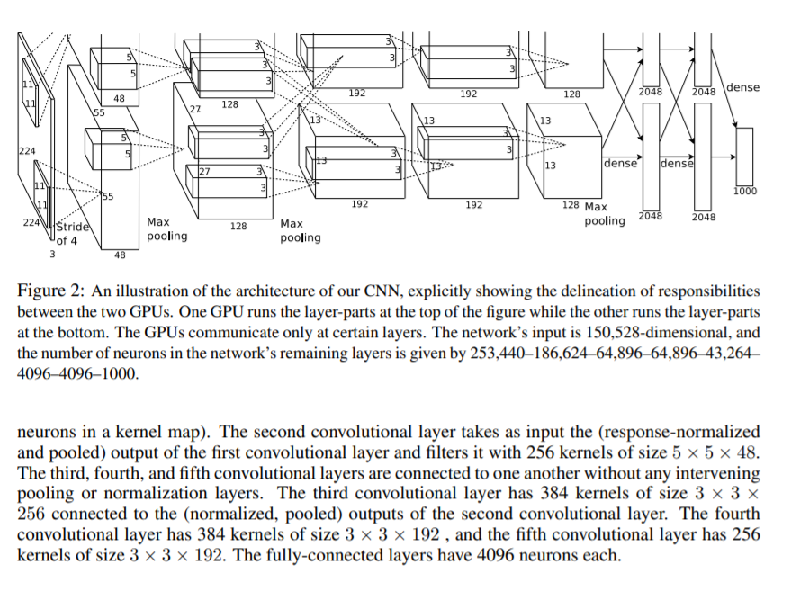

现在我们准备描述我们的CNN的整体架构。如图2所示，我们的网络包含8个带权重的层；前5层是卷积层，剩下的3层是全连接层。最后一层全连接层的输出是1000维softmax的输入，softmax会产生1000类标签的分布。我们的网络最大化多项逻辑回归的目标，这等价于最大化预测分布下训练样本正确标签的对数概率的均值。

第2，4，5卷积层的核只与位于同一GPU上的前一层的核映射相连接（看图2）。第3卷积层的核与第2层的所有核映射相连。全连接层的神经元与前一层的所有神经元相连。第1，2卷积层之后是响应归一化层。3.4节描述的这种最大池化层在响应归一化层和第5卷积层之后。ReLU非线性应用在每个卷积层和全连接层的输出上。

第1卷积层使用96个核对224 × 224 × 3的输入图像进行滤波，核大小为11 × 11 × 3，步长是4个像素（核映射中相邻神经元感受野中心之间的距离）。第2卷积层使用用第1卷积层的输出（响应归一化和池化）作为输入，并使用256个核进行滤波，核大小为5 × 5 × 48。第3，4，5卷积层互相连接，中间没有接入池化层或归一化层。第3卷积层有384个核，核大小为3 × 3 × 256，与第2卷积层的输出（归一化的，池化的）相连。第4卷积层有384个核，核大小为3 × 3 × 192，第5卷积层有256个核，核大小为3 × 3 × 192。每个全连接层有4096个神经元。

### 减少过拟合

我们的神经网络架构有6000万参数。尽管`ILSVRC`的1000类使每个训练样本从图像到标签的映射上强加了10比特的约束，但这不足以学习这么多的参数而没有相当大的过拟合。下面，我们会描述我们用来克服过拟合的两种主要方式。

#### 数据增强

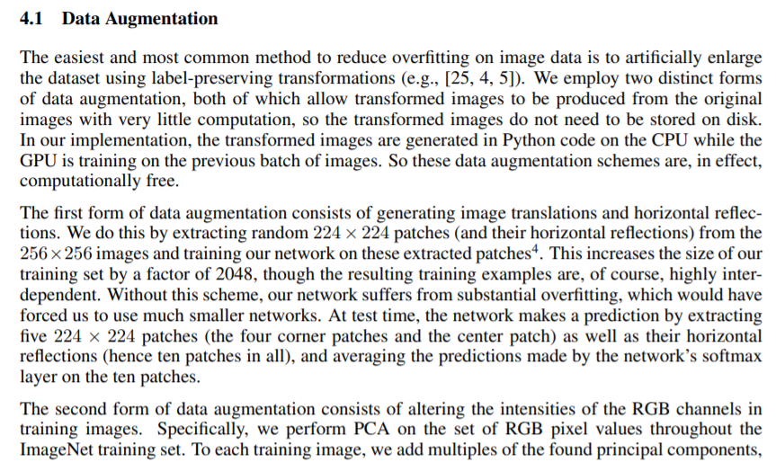

图像数据上最简单常用的用来减少过拟合的方法是使用标签保留变换（例如[25, 4, 5]）来人工增大数据集。我们使用了两种独特的数据增强方式，这两种方式都可以从原始图像通过非常少的计算量产生变换的图像，因此变换图像不需要存储在硬盘上。在我们的实现中，变换图像通过CPU的Python代码生成，而此时GPU正在训练前一批图像。因此，实际上这些数据增强方案是计算免费的。

第一种数据增强方式包括产生图像变换和水平翻转。我们从256×256图像上通过随机提取`224 × 224`的图像块实现了这种方式，然后在这些提取的图像块上进行训练。这通过一个2048因子增大了我们的训练集，尽管最终的训练样本是高度相关的。没有这个方案，我们的网络会有大量的过拟合，这会迫使我们使用更小的网络。在测试时，网络会提取5个`224 × 224`的图像块（四个角上的图像块和中心的图像块）和它们的水平翻转（因此总共10个图像块）进行预测，然后对网络在10个图像块上的softmax层进行平均。

第二种数据增强方式包括改变训练图像的RGB通道的强度。具体地，我们在整个ImageNet训练集上对RGB像素值集合执行PCA。对于每幅训练图像，我们加上多倍找到的主成分，大小成正比的对应特征值乘以一个随机变量，随机变量通过均值为0，标准差为0.1的高斯分布得到。因此对于每幅RGB图像像素
I x y = [ I x y R , I x y G , I x y B ] T I_{xy}=[I^R_{xy},I^G_{xy},I^B_{xy}]^T*I**x**y*​=[*I**x**y**R*​,*I**x**y**G*​,*I**x**y**B*​]*T*，我们加上下面的数量：
[ p 1 , p 2 , p 3 ] [ α 1 λ 1 , α 2 λ 2 , α 3 λ 3 ] T [p_1,p_2,p_3][α_1λ_1,α_2λ_2,α_3λ_3]^T[*p*1​,*p*2​,*p*3​][*α*1​*λ*1​,*α*2​*λ*2​,*α*3​*λ*3​]*T*

p i p_ip**i，λ i λiλ**i分别是RGB像素值3 × 3协方差矩阵的第ii个特征向量和特征值，α i αiα**i是前面提到的随机变量。对于某个训练图像的所有像素，每个α i α_iα**i只获取一次，直到图像进行下一次训练时才重新获取。这个方案近似抓住了自然图像的一个重要特性，即光照的颜色和强度发生变化时，目标身份是不变的。这个方案减少了top 1错误率1%以上

#### dropout

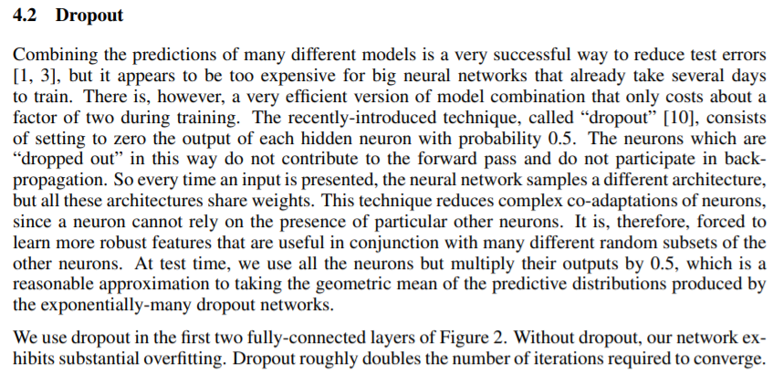

将许多不同模型的预测结合起来是降低测试误差[1, 3]的一个非常成功的方法，但对于需要花费几天来训练的大型神经网络来说，这似乎太昂贵了。然而，有一个非常有效的模型结合版本，它只花费两倍的训练成本。这种最近引入的技术，叫做"dropout"[10]，它会以0.5的概率对每个隐层神经元的输出设为0。那些“失活的”的神经元不再进行前向传播并且不参与反向传播。因此每次输入时，神经网络会采样一个不同的架构，但所有架构共享权重。这个技术减少了复杂的神经元互适应，因为一个神经元不能依赖特定的其它神经元的存在。因此，神经元被强迫学习更鲁棒的特征，它在与许多不同的其它神经元的随机子集结合时是有用的。在测试时，我们使用所有的神经元但它们的输出乘以0.5，对指数级的许多失活网络的预测分布进行几何平均，这是一种合理的近似。

我们在图2中的前两个全连接层使用失活。如果没有失活，我们的网络表现出大量的过拟合。失活大致上使要求收敛的迭代次数翻了一倍。

### 学习细节

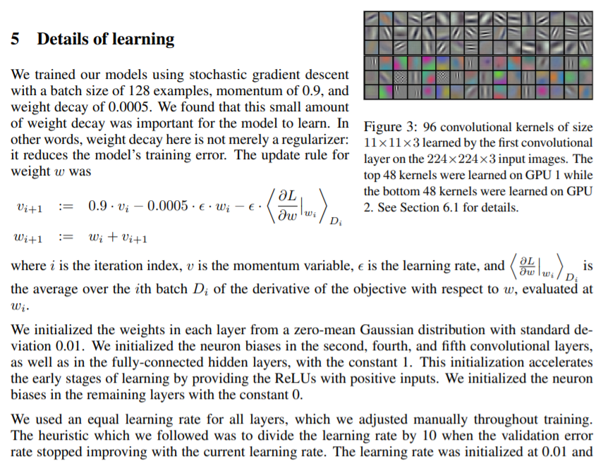

我们使用随机梯度下降来训练我们的模型，样本的batch size为128，动量为0.9，权重衰减为0.0005。我们发现少量的权重衰减对于模型的学习是重要的。换句话说，权重衰减不仅仅是一个正则项：它减少了模型的训练误差。权重w的更新规则是

i是迭代索引，v是动量变量，ε是学习率，是目标函数对w，在上的第i 批微分Di的平均。

我们使用均值为0，标准差为 0.01的高斯分布对每一层的权重进行初始化。我们在第2，4，5卷积层和全连接隐层将神经元偏置初始化为常量1。这个初始化通过为ReLU提供正输入加速了学习的早期阶段。我们在剩下的层将神经元偏置初始化为0。

我们对所有的层使用相等的学习率，这个是在整个训练过程中我们手动调整得到的。当验证误差在当前的学习率下停止提供时，我们遵循启发式的方法将学习率除以10。学习率初始化为0.01，在训练停止之前降低三次。我们在120万图像的训练数据集上训练神经网络大约90个循环，在两个NVIDIA GTX 580 3GB GPU上花费了五到六天。

### 结果

我们在ILSVRC-2010上的结果概括为表1。我们的神经网络取得了top-1 37.5%，top-5 17.0%的错误率。在ILSVRC-2010竞赛中最佳结果是top-1 47.1%，top-5 28.2%，使用的方法是对6个在不同特征上训练的稀疏编码模型生成的预测进行平均，从那时起已公布的最好结果是top-1 45.7%，top-5 25.7%，使用的方法是平均在Fisher向量（FV）上训练的两个分类器的预测结果，Fisher向量是通过两种密集采样特征计算得到的。

我们也用我们的模型参加了ILSVRC-2012竞赛并在表2中报告了我们的结果。由于ILSVRC-2012的测试集标签不可以公开得到，我们不能报告我们尝试的所有模型的测试错误率。在这段的其余部分，我们会使用验证误差率和测试误差率互换，因为在我们的实验中它们的差别不会超过0.1%（看图2）。本文中描述的CNN取得了top-5 18.2%的错误率。五个类似的CNN预测的平均误差率为16.4%。为了对ImageNet 2011秋季发布的整个数据集（1500万图像，22000个类别）进行分类，我们在最后的池化层之后有一个额外的第6卷积层，训练了一个CNN，然后在它上面进行“fine-tuning”，在ILSVRC-2012取得了16.6%的错误率。对在ImageNet 2011秋季发布的整个数据集上预训练的两个CNN和前面提到的五个CNN的预测进行平均得到了15.3%的错误率。第二名的最好竞赛输入取得了26.2%的错误率，他的方法是对FV上训练的一些分类器的预测结果进行平均，FV在不同类型密集采样特征计算得到的。

最后，我们也报告了我们在ImageNet 2009秋季数据集上的误差率，ImageNet 2009秋季数据集有10,184个类，890万图像。在这个数据集上我们按照惯例用一半的图像来训练，一半的图像来测试。由于没有建立测试集，我们的数据集分割有必要不同于以前作者的数据集分割，但这对结果没有明显的影响。我们在这个数据集上的的top-1和top-5错误率是67.4%和40.9%，使用的是上面描述的在最后的池化层之后有一个额外的第6卷积层网络。这个数据集上公开可获得的最好结果是78.1%和60.9%。

#### 定性评估

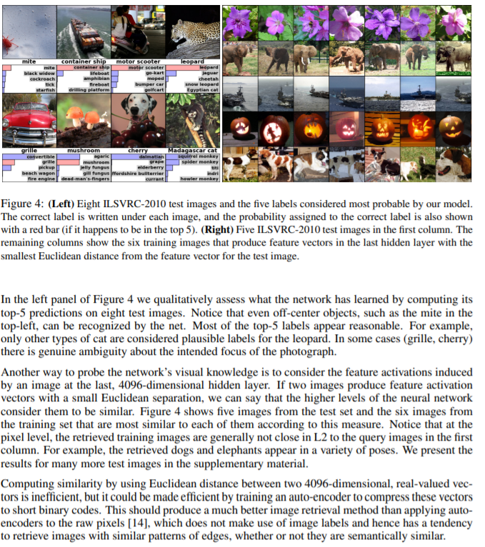

图3显示了网络的两个数据连接层学习到的卷积核。网络学习到了大量的频率核、方向选择核，也学到了各种颜色点。注意两个GPU表现出的专业化，3.5小节中描述的受限连接的结果。GPU 1上的核主要是没有颜色的，而GPU 2上的核主要是针对颜色的。这种专业化在每次运行时都会发生，并且是与任何特别的随机权重初始化（以GPU的重新编号为模）无关的。

图3：第一卷积层在`224×224×3`的输入图像上学习到的大小为`11×11×3`的96个卷积核。上面的48个核是在GPU 1上学习到的而下面的48个卷积核是在GPU 2上学习到的。更多细节请看6.1小节。

在图4的左边部分，我们通过在8张测试图像上计算它的top-5预测定性地评估了网络学习到的东西。注意即使是不在图像中心的目标也能被网络识别，例如左上角的小虫。大多数的top-5标签似乎是合理的。例如，对于美洲豹来说，只有其它类型的猫被认为是看似合理的标签。在某些案例（格栅，樱桃）中，网络在意的图片焦点真的很含糊。

图4：（左）8张ILSVRC-2010测试图像和我们的模型认为最可能的5个标签。每张图像的下面是它的正确标签，正确标签的概率用红条表示（如果正确标签在top 5中）。（右）第一列是5张ILSVRC-2010测试图像。剩下的列展示了6张训练图像，这些图像在最后的隐藏层的特征向量与测试图像的特征向量有最小的欧氏距离。

探索网络可视化知识的另一种方式是思考最后的4096维隐藏层在图像上得到的特征激活。如果两幅图像生成的特征激活向量之间有较小的欧式距离，我们可以认为神经网络的更高层特征认为它们是相似的。图4表明根据这个度量标准，测试集的5张图像和训练集的6张图像中的每一张都是最相似的。注意在像素级别，检索到的训练图像与第一列的查询图像在L2上通常是不接近的。例如，检索的狗和大象似乎有很多姿态。我们在补充材料中对更多的测试图像呈现了这种结果。

通过两个4096维实值向量间的欧氏距离来计算相似性是效率低下的，但通过训练一个自动编码器将这些向量压缩为短二值编码可以使其变得高效。这应该会产生一种比将自动编码器应用到原始像素上[14]更好的图像检索方法，自动编码器应用到原始像素上的方法没有使用图像标签，因此会趋向于检索与要检索的图像具有相似边缘模式的图像，无论它们是否是语义上相似。

### 探讨

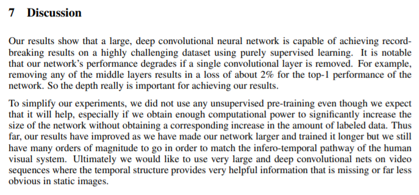

我们的结果表明一个大型深度卷积神经网络在一个具有高度挑战性的数据集上使用纯有监督学习可以取得破纪录的结果。值得注意的是，如果移除一个卷积层，我们的网络性能会降低。例如，移除任何中间层都会引起网络损失大约2%的top-1性能。因此深度对于实现我们的结果非常重要。

为了简化我们的实验，我们没有使用任何无监督的预训练，尽管我们希望它会有所帮助，特别是在如果我们能获得足够的计算能力来显著增加网络的大小而标注的数据量没有对应增加的情况下。到目前为止，我们的结果已经提高了，因为我们的网络更大、训练时间更长，但为了匹配人类视觉系统的下颞线（视觉专业术语）我们仍然有许多数量级要达到。最后我们想在视频序列上使用非常大的深度卷积网络，视频序列的时序结构会提供非常有帮助的信息，这些信息在静态图像上是缺失的或远不那么明显。

## 对论文中的细节分析

（过几天再写）

